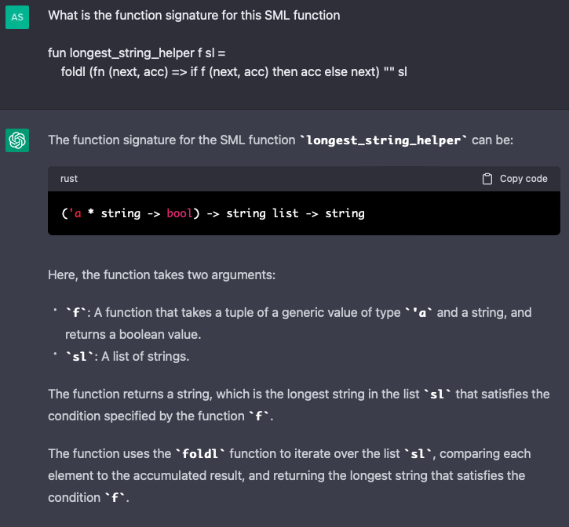

+++
linkTitle = "AI helping a programmer"
title = "AI helping a programmer"
draft = false
date = 2023-02-01
+++

I am attempting to solve a homework problem that asks me to write a helper function to use in a later problem. I have gotten 95% of the way there with this function, written in Standard ML:

```sml
fun longest_string_helper f sl =
	foldl (fn (next, acc) => if f (next, acc) then acc else next) "" sl
```

The purpose of this function is to take a function `f` and apply something called a **left fold** across each element of the list *sl*. Each answer is stored in an **accumulator**, which is instantiated to the empty string. 

A hint in the homework suggested that the function signature for this problem should be:

`val longest_string_helper = fn : (int * int -> bool) -> string list -> string`

However, the function I wrote has a function signature of:

`val longest_string_helper = fn : (string * string -> bool) -> string list -> string`

The function passed in accepts a tuple `(string, string)`, when it should accept a tuple `(int, int)`.

I changed the initial accumulator value to `0`, but this changed the function signature to `(int * int -> bool) -> int list -> int`. The passed-in function's signature was correct, but the remaining elements of the overall signature were wrong. I tried various other minor changes, with no luck. I knew the answer was within reach, but I couldn't find it.

After about two hours of reading notes, class forums, and an intense internet search, I finally resorted to asking ChatGPT-3. In the past, it has struggled to provide correct advice about Standard ML. So I warily asked it for help: 



Right away, the answer is wrong. ChatGPT-3 seems to think the signature for the passed-in function is a tuple of any-type `'a` and `string` returning a `bool`, when this clearly was not the case. I next asked a follow-up question:


This answer is close! The homework does not permit using this `size` function, but it does permit `String.size`. The function signature is now correct after making these modifications:

```sml
fun longest_string_helper f sl =
	foldl (fn (next,acc) => if f (String.size next, String.size acc) then acc else next) "" sl
```

The function signature is now `val longest_string_helper = fn : (int * int -> bool) -> string list -> string`.

-----

I learned the following:  

1) Try to solve the problem without assistance - just use your brain.
2) Re-read your notes and all available class resources to gain further insight into the problem.
3) If AI assistance must be used, learn everything possible about the final solution. In my case, I wrote this short report :)
