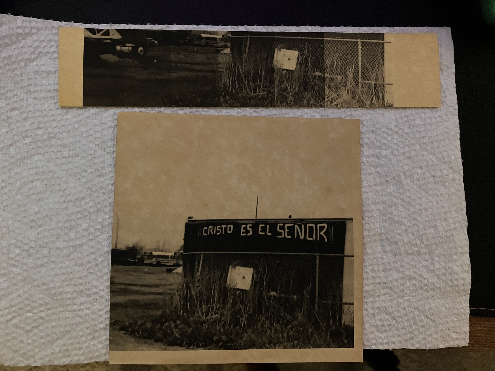

+++
linkTitle = 'Darkroom Experiment #1'
title = 'Darkroom Experiment #1: coffee, vitamin C, and laundry soda'
shortTitle = 'Darkroom Experiment #1'
date = 2024-07-28T23:04:25-06:00
genres = ['other']
draft = false
audioFile = ""
audioTitle = ""
+++

Darkroom photography has always been a side hobby for me. Pursuit of this hobby imparts a feeling that no other hobby of mine does. Recently, a colleague curiously inquired about this hobby. I took this interest as a sign for me to get back in the darkroom, and two weeks later, I'm mixing my own bio-friendly developer chemicals, Colorado-style.

---

## Caffenol

Order powdered Vitamin C.

Research something called "washing soda". It's the younger brother of baking soda, but somehow also safe. It's for washing clothes - don't drink it.

Shop ebay for some more vintage darkroom equipment, and order a set of 8x10" Cesco Enamel Porcelain trays, likely from the 1980s. Pay too much for them at auction, but it's okay because they add to the vibe.

Late on Sunday, decide that it's time for an experiment. Mix 25g vitamin C powder, 45g instant coffee, and 24g washing soda with 1000ml water. The liquid is a lot darker than I expected - but after all, it's just coffee that you can't drink.

Whip up some stop bath, and lay out the trays. It's time for a print. I quickly select a negative strip, without paying much attention to the content. The negative is placed in the negative carrier on the enlarger, a photo is selected, and an easel is loaded with a test strip. Arbitrarily, some times are select and a test strip is exposed. 

The test strip is dipped and agitated in the previously-prepared not-coffee solution. Nothing happens for 30, 60, 90 seconds. I step away to clean up, and then return.

The paper is completely black. Is that good? Sort of. Something happened! But what?

I left the lens completely open on the enlarger. Rookie mistake! f2 will burn the image to black in seconds flat. I stop the lens down to f8, and try a new round of test strips. Still black. I adjust the times down - and finally, something resembling a photo appears! After a handful more test strips, it is time for the final print.

## The results

Under the dim, red light, a definite picture is visible. I make a batch of fixer, because this print is worth seeing in the light. A few minutes later, I bring the print into the light:

## Impressions

I stare at this print for several minutes, transfixed by the results. This worked far better than I expected. The unique texture adds a unique character to the whole print, much how the analog CRT television sets of my childhood imparted a unique feel to the images they displayed.

Oddly enough, the sensory organ most struck by this image is not the eyes, but the nose - the print smells like a stale cup of coffee. It's not an unpleasant smell, faintly earthy, and lightly fruity. The texture, appearance, and smell make this print look like an old piece of cardboard. All of this is oddly appealing.

## Why?

Why do this? Why navel-gaze to such an extent, what is with all the single-minded pursuits, followed by painstaking description of the whole process? Honestly, I have no idea. All I can think of, is this is all supposed to be practice for something. All of it, from making developer out of coffee, carefully documenting my feelings, writing them down in a website I coded up manually, instead of making a Wordpress like a sane person with other things to do. This all is supposed to build to something. I still have no idea what though.