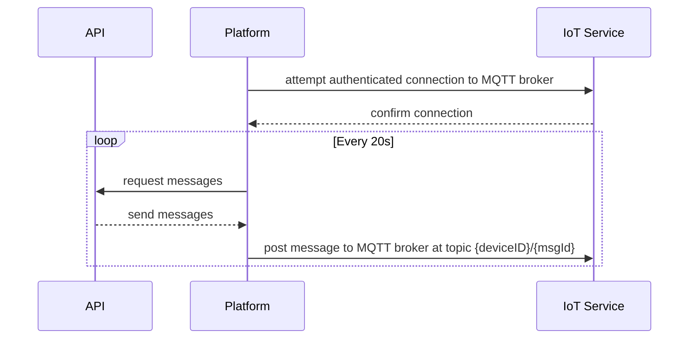
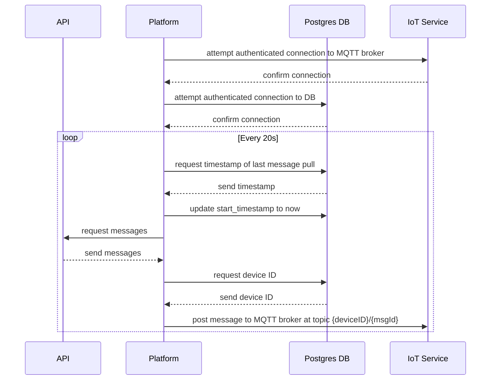
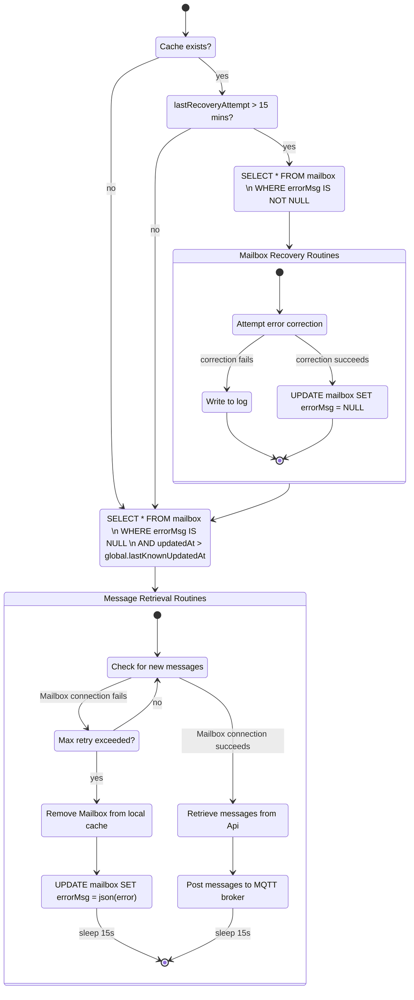

+++
title = 'Diagrams as Code'
date = 2024-02-29T17:24:50-07:00

draft = false
+++

A major pain point in the process of maintaining documentation is that, while a product is in development, documentation tends to go stale quickly. This can occur for a number of reasons:

- Engineers don't know how to create useful documentation
- Documentation is kept separately from the work being done
- Only a small subset of engineers are tasked with creating and maintaining documentation

The first problem is a large challenge. Learning how to write good documentation is an entire course. Learning how to create good diagrams is an entire course. 

Fortunately, the last two problems can be partially addressed relatively easily - by saving diagrams as code.

## Definitions

- <u>Diagram</u>: A visual representation of an engineered system
- <u>Code</u>: Text that makes a machine do things
- <u>Version Control</u>: A system that tracks atomic changes to a file

Put that all together:

- <u>Diagrams as code</u>: A text file that is parsed to generate an image, and which can be committed to version control.

## Why save diagrams as code?

- Diagrams should not be an artistic exercise
- Diagrams should be version-controlled with reliable tools
- Diagrams should be useful for new team members

### 1. Engineering diagrams aren't a form of artistic expression

Picture this scenario - you construct a perfect symmetrical system diagram, arranging subsystem components in rounded boxes at the vertices of an equilateral pentagon. It is beautiful; it is pristine.

And then someone decides to add a subsystem.

The solution is simple: 

- Care less about whether boxes in a diagram line up
- Care more about what the boxes actually communicate

### 2. Diagrams should be committed to version-control

Many WYSIWYG/visual-first tools have poor internal implementations of "version-control". These tools typically allow a user to "checkpoint" an image manually. However, the checkpoints often have cryptic names, such as "v.203". If a mistake is made, there is no way to easily figure out the last "good" state of a diagram.

The solution here is to use a text-based diagramming tool, so one may take advantage of fully-featured version-control systems, such as `git`. Mistakes can be traced with `git bisect`.The commit history can easily be searched from the command line. All of the powerful capabilities of `git` can be used to track changes to a diagram.

### 3. Diagrams should be useful to new team members

Last, and most importantly - diagrams must be useful to new team members. Imagine that a new member joins the team, and needs to understand the architecture of a codebase. Naturally, they will reach for documentation. But they discover that the documentation is out of date.

Stale documentation can be worse than no documentation. New team members cannot distinguish stale from up-to-date documentation, and will develop an incorrect mental model of the system. This can be very difficult to correct once the misunderstanding is complete.

The solution is to keep documentation as close to code as possible. Ideally, it should live in the same repo as the code. A task for every pull request should be to review relevant documentation and include updates if needed. This extra work to maintain documentation in each PR will save significant time trying to re-explain how a system works, to a team member that has learned the wrong information.  

### How does one actually create a "diagram as code" diagram?

There has recently been a renaissance of "diagram as code" tools. With support from GitHub (including native rendering in repositories), mermaid.js appear to be leading the pack. Other popular options include ZenUML and PlantUML.  

But what about tools like LucidChart, diagrams\.net, and Microsoft Visio? These tools are popular for remote whiteboarding sessions. Why can't the outputs of those tools simply be committed to version control?

| Tool | Can be VC'd in e.g. git | Text -> Image | Addressable in PR | 
| - | - | - | - |
| mermaid.js | <span style="color: green">Yes</span> | <span style="color: green">Yes</span> | <span style="color: green">Yes</span> | 
| ZenUML | <span style="color: green">Yes</span> | <span style="color: green">Yes</span> | <span style="color: green">Yes</span> |
| PlantUML | <span style="color: green">Yes</span> | <span style="color: green">Yes</span> | <span style="color: green">Yes</span> |
| draw\.io/diagrams.net | <span style="color: green">Yes</span> | <span style="color: red">No</span> | <span style="color: red">No</span> |
| LucidChart | <span style="color: green">Yes</span> | <span style="color: red">No</span> | <span style="color: red">No</span> |
| MS Visio | <span style="color: green">Yes</span> | <span style="color: red">No</span> | <span style="color: red">No</span> |
| Cell phone pictures of whiteboards | <span style="color: green">Yes</span> | <span style="color: red">No</span> | <span style="color: red">No</span> |

In the chart above, I have selected the following criteria to compare tools by:

- Artifacts can be version-controlled in e.g. git
- Artifacts can be defined using pur text, which is then parsed to create a diagram
- Artifacts can be atomically addressed in a pull request

In theory, one may commit any file type to version control. In practice, there is limited value to using version-control to track changes to a .svg or .jpeg file type, file types which are used to represent vector graphics and images, respectively. A .svg contains too much non-value-add information, used to describe what a graphic looks like. The signal-to-noise ratio in a diff'd image file is extremely low, in other words.

On the other hand, diff'd text files have a much higher signal-to-noise ratio. Each diff'd character corresponds to a visible change in the generated output of the diagramming tool.

## Examples

Enough pedantry, let's take a look at a couple of examples. I have taken a liking to a tool called mermaid.js lately, so all of the following examples will use that tool.

### Sequence Diagrams

>...a sequence diagram captures the behavior of a single scenario. The diagram shows a number of example objects and the messages that are passed between these objects within the user case.
>
> -- <cite>Fowler, Martin. UML Distilled: A Brief Guide to the Standard Object Modeling Language. 3rd ed., 2003</cite>

As the textbook definition alludes to, a sequence diagram can be used to described any set of systems that share messages. To keep the analogy concrete, let's look at an example of a real message transit service.

Let's consider a system composed of an `API` subsystem, `Platform` subsystem, and `IoT Service` subsystem. The API is responsible for handling the external interface. The Platform is responsible for handling "business logic". The IoT Service is responsible for hosting the MQTT messaging service.



A minimalist, clean, and informative diagram (such as the one above) is created with the following mermaid.js code:

```text
sequenceDiagram

participant API as API
participant F as Platform
participant IoT as IoT Service

F->>IoT: attempt authenticated connection to MQTT broker
IoT-->>F: confirm connection

loop Every 20s
    F->>API: request messages
    API-->>F: send messages

    F->>IoT: post message to MQTT broker at topic {deviceID}/{msgId}
end
```

What happens if one would like to add a new database service to the diagram, perhaps in-between the `Platform` and `IoT Service` subsystems? 



In a traditional WYSIWYG editor, this task could take some time and incur significant frustration, because many distinct GUI elements must be manually moved or re-drawn. Not the case in a text-first diagramming tool:

```text
sequenceDiagram
 
 participant API as API
 participant F as Platform
+participant Pg as Postgres DB
 participant IoT as IoT Service
 
 F->>IoT: attempt authenticated connection to MQTT broker
 IoT-->>F: confirm connection
 
+F->>Pg: attempt authenticated connection to DB
+Pg-->>F: confirm connection
+
 loop Every 20s
+    F->>Pg: request timestamp of last message pull 
+    Pg-->>F: send timestamp
+
+    F->>Pg: update start_timestamp to now
+
     F->>API: request messages
     API-->>F: send messages
 
+    F->>Pg: request device ID 
+    Pg-->>F: send device ID
+
     F->>IoT: post message to MQTT broker at topic {deviceID}/{msgId}
 end

```

One new participant and a handful of new messages are all that need to be defined, and mermaid.js takes care of figuring out how the boxes and arrows should be arranged. As mentioned earlier, every highlighted line in the diff corresponds to a visible change in the diagram. That's excellent!

### Activity Diagrams

> Activity diagrams are a technique to describe procedural logic, business process, and work flow. 
>
> -- <cite>Fowler, Martin. UML Distilled.</cite>

Activity diagrams are similar to state diagrams, except that they model the activity of system, as opposed to the various states that a system can exist in. UML purists may cringe at the use of state diagram syntax to describe an activity diagram, but the behavior of a system can still be effectively communicated.



Imagine editing this diagram in a WYSIWYG editor. Not fun. In a text-based diagramming tool, the task is a breeze - this entire diagram can be defined in less than 75 lines of code, including comments for clarity:

```shell
stateDiagram-v2
  # State Definitions
  ## Main start conditions
  Q_cache_exists : Cache exists?
  Q_checkLastRecovery : lastRecoveryAttempt > 15 mins?

  ## Composite States
  mbRecovRoutine : Mailbox Recovery Routines
  msgRetrievalRoutine : Message Retrieval Routines

  ## Mailbox Recovery Routines
  retrieveInvalidMbs : SELECT * FROM mailbox \n WHERE errorMsg IS NOT NULL
  errCorrect : Attempt error correction
  writeLog : Write to log
  deletePgError : UPDATE mailbox SET errorMsg = NULL

  ## Message Retrieval Routines
  retrieveValidMbs : SELECT * FROM mailbox \n WHERE errorMsg IS NULL \n AND updatedAt > global.lastKnownUpdatedAt
  checkMsgs : Check for new messages 
  Q_maxRetryExceed : Max retry exceeded?

  ### Success States
  retrieveMsgs : Retrieve messages from Api
  sendToMqtt : Post messages to MQTT broker

  ### Failure States
  removeMbFromCache : Remove Mailbox from local cache
  writeErrToPg : UPDATE mailbox SET errorMsg = json(error)

  # State Transitions
  ## Start state
  [*] --> Q_cache_exists

  ## Mailbox Recovery Routines
  Q_cache_exists --> Q_checkLastRecovery: yes
  Q_checkLastRecovery --> retrieveInvalidMbs: yes
  retrieveInvalidMbs --> mbRecovRoutine
  state mbRecovRoutine {
    [*] --> errCorrect
    errCorrect --> writeLog : correction fails
    writeLog --> [*]
    errCorrect --> deletePgError: correction succeeds
    deletePgError --> [*]
  }

  ## Message Retrieval Routines
  Q_cache_exists --> retrieveValidMbs: no
  Q_checkLastRecovery --> retrieveValidMbs : no
  retrieveValidMbs --> msgRetrievalRoutine
  mbRecovRoutine --> retrieveValidMbs
  state msgRetrievalRoutine {
    [*] --> checkMsgs
    checkMsgs --> retrieveMsgs: Mailbox connection succeeds
    checkMsgs --> Q_maxRetryExceed  : Mailbox connection fails
    Q_maxRetryExceed --> checkMsgs : no
    Q_maxRetryExceed --> removeMbFromCache : yes
    removeMbFromCache --> writeErrToPg
    writeErrToPg --> [*]: sleep 15s
    retrieveMsgs --> sendToMqtt
    sendToMqtt --> [*]: sleep 15s
  }
```

## Conclusion

Prefer diagrams as code.  

- It makes developers want to work on documentation, because it looks like (and is) code.  
- It allows one to take advantage of powerful open-source version-control tools, such as git.  
- It helps documentation stay up-to-date and remain useful for new team members.
