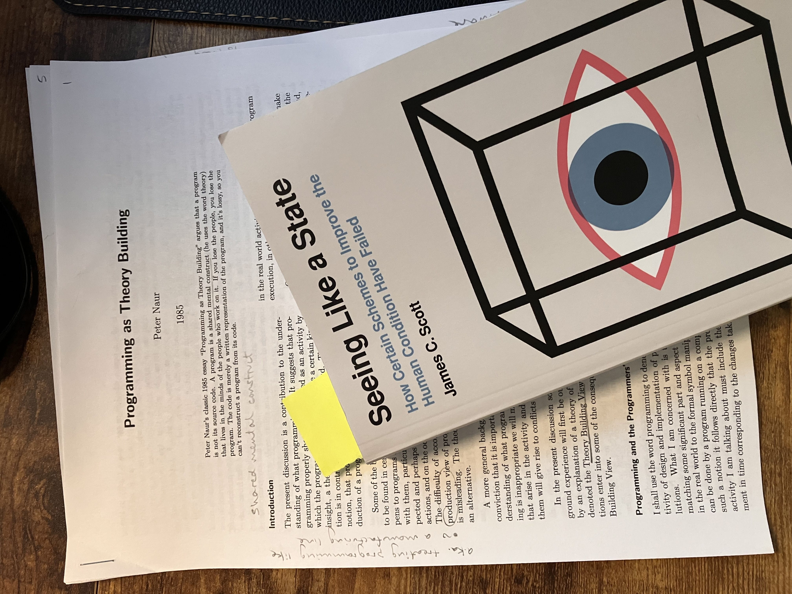

+++
linkTitle = 'Do the Illegible'
title = 'Do the Illegible'
shortTitle = 'Do the Illegible'
date = 2025-07-14T16:01:42-06:00
genres = ['technical']
draft = false
audioFile = ""
audioTitle = ""
+++

Someone revoked my GitHub access at work by accident[^github-revoked] today, so I decided to catch up on some reading. I read Peter Naur's 1985 essay [Programming as Theory Building](https://pablo.rauzy.name/dev/naur1985programming.pdf). Published 40 years ago, Naur's essay feels very relevant today, at a time when software developers struggle to understand their place in an AI-driven world.

While reading the section titled "Program Life, Death, and Revival", I was struck by the parallels to a book that I have spent the better part of a year reading - *Seeing Like a State*, by James C. Scott, who was a political science professor at Yale University. The subtitle on the cover reads, "How Certain Schemes to Improve the Human Condition Have Failed". It's not the most upbeat read, but it is a fascinating view of the world from the year 1998.

Alan Perlis said, "A language that doesn't affect the way you think about programming, is not worth knowing."[^perlis]. I would extend that to say that a book that doesn't affect the way you think about the world isn't worth reading either. *Seeing Like a State* has affected my world-view by adding the notion of *legibility* to my thinking.

## Seeing Like a State

> Legibility: [The process by which] officials took exceptionally complex, illegible, and local social practices (such as land tenure customs or naming customs) and created a standard grid whereby it could be centrally recorded and monitored.[^scott-legibility]

A number of examples of *legibility* are given throughout the book, including the high-modernist city of Brasilia (designed by a student of modernist architect Le Corbusier), the great collectivization experiment in the former Soviet Union[^scott-soviet], and compulsory villagization in Tanzania[^scott-tanzania].

Large institutions prefer that their subjects behave in "legible" ways. Ways which can be observed, monitored - and ultimately taxed and constrained. Another example may be the taming of the American West by the United States government. For one, it meant that politicans could benefit from the highly profitable activities that were occurring far from the nation's capitol.

## Programming as Theory Building

Let's return to software. Peter Naur's essay describes how the actual physical code generated by the act of programming a computer is insufficient to build a "theory" of the computer program at hand. Using an example of how team B cannot seamlessly adopt team A's code without (at minimum) a strong exchange of ideas about why the program exists, Naur concludes that:

> ...the full program text and additional documentation is insufficient in conveying to even the highly motivated group B the deeper insight into the design, that **theory** which is immediately present to the members of group A.

In other words, the *illegible* is what team A's computer program is really about. The information that only the humans on team A know - about why one architecture was selected over another equally-viable option, about why variables are named the way they are, about why a bootstrapping sequence for the dev and prod servers is configured a certain way - this is where the connection to the real world begins, and is often not explained properly by any amount of documentation and *legible* works generated by the team. When onboarding to a new team, the time you spend getting "acquainted" with a codebase, learning the team's idioms, talking to non-technical stakeholders - that's when you're learning the *illegible*.

Naur continues, and defines theory-building as the following:

> Theory Building View: ...programming in this sense must be the programmers' building up knowledge of a certain kind, knowledge taking to be basically the programmers' immediate possession, any **documentation being an auxiliary, secondary product**.

In the world of set theory, the *Theory of the Program* is the set of information that excludes any type of recordable documentation, whether it is code or human-language descriptions of the program. The *Theory of the Program* is the programmer's internal model, as it is expressed through their computer code. It's comparable to a writer sharing their internal world-view through their writing.

As a programmer, how does one determine if they've built a sufficient "theory" of their program? Naur lists three things that the programmer with a good theory can do [^naur]:

> 1) Explain how the solution relates to the affairs of the world that it helps to handle...the programmer must be able to explain, for each part of the program text and for each of its overall structural characteristics, what aspect or activity of the world is matched by it.

> 2) Explain why each part of the program is what it is, in other words is able to support the actual program text with a justification of some sort. 

> 3) Respond constructively to any demand for a modification of the program so as to support the affairs of the world in a new manner...the kind of similarity [between the new demand and the operational facilities already built into the program] is one between aspects of the world, [and] only makes sense to the agent who has knowledge of the world.

## The Intersection

Do you feel uncomfortable yet, with all this talk of implicit knowledge that is only transferable by talking to the original programmers? It's not your fault, the companies we work for have been serving us Agile-flavored Kool-Aid for decades. It's all that many of us know, and we think that's how great software is made!

One goal of a well-oiled software-producing machine is to for the software-producing cogs in their machine to be interchangeable, hot-swappable, bus-factorable. The last thing they want is their developers to internalize theories of their program, because this means the process of software development is now becoming illegible to the company. The company cedes control and power to expensive, work-from-home-demanding, shorts-wearing software developers. The horror!

To solve this pesky problem, the software-producing machines joined forces to develop:

> Programming Methods: A set of **work rules for programmers**, telling what kinds of things programmer should do, in what order, which notations or languages to use, and what kinds of documents to produce at various stages.[^naur]

Sound familiar? Remember that this essay was written in 1985, before Agile, and much closer in history to Fred Brooks' *Mythical Man-Month*. In my view, Brooks' *Mythical Man-Month* takes the opposite stance of Naur's, that programming is TOO illegible. Brooks ultimately advocates for more companies to turn the act of programming into an engineering discipline.

## Now what?

Naur concludes his essay[^naur]:

> On the Theory Building View the primary result of the programming activity is the theory held by the programmers. Since this theory by its very nature is part of the mental possession of each programmer, it follows that **the notion of the programmer as an easily replaceable component in the program production activity has to be abandoned**. Instead the programmer must be regarded as a **responsible developer** and manager of the activity in which **the computer is a part**. In order to fill this position he or she must be given a permanent position, of a status similar to that of other professionals, such as engineers and lawyers, whose active contributions as employers of enterprises rest on their **intellectual proficiency**.

In other words, Naur recommends to treat the programmer as a software professional, not a low-agency code-slinger. 

And this actually connects nicely to today, to a very modern and relevant phenomenon - the vibe-coding software professional. Where does the activity of vibe-coding fit in to this discussion? Andrej Karpathy, an AI researcher and originator of the term, defines:

> Vibe Coding: Fully give in to the vibes, embrace exponentials, and forget that the code even exists...I just see stuff, say stuff, run stuff, and copy paste stuff, and it mostly works.[^karpathy]

If Naur is right (and I think he is), vibe-coding is *precisely the wrong direction* we should be going as software professionals! We are ceding all attempts at Theory Building to AI systems, systems owned and trained by the biggest corporations on the planet, hoovering up all our theories of programming and leaving us with stochastic parrots to play slots with, whose inner-workings even the corporations do not understand! 

We should not cede control like this to the big corporations. But we also should not sneeze at AI as something to avoid. Let's use AI to learn more about the systems we're building, ask better questions, interactively red-team our designs and architectures, and yes even generate code (which we then spend the time to understand and save to our *illegible* knowledge repositories).

--

The link between Naur, Scott, and the state of software today has been interesting to uncover. I hope to organize my thoughts better and do another dive into this subject. I still need to finish "Seeing Like a State" as well. My GitHub access has since been restored, so it is now time for me to return to being a good cog in the legible system.

[^github-revoked]: Turns out, at *{INSTITUTION REDACTED}*, you need to submit a PR which adds a person to a secret text file somewhere, in order to modify permissions in GitHub. Multiple people had to approve the PR. Someone had styling-feedback about how the array of names needs to end with a `,`. But at least it's legible!
[^perlis]: [Perlis, Alan. *Epigrams on Programming*. Association for Computing Machinery SIGPLAN, 1982.](https://www.cs.yale.edu/homes/perlis-alan/quotes.html#:~:text=19.%20A%20language%20that%20doesn%27t%20affect%20the%20way%20you%20think%20about%20programming%2C%20is%20not%20worth%20knowing)
[^scott-legibility]: Scott, James C. Page 2, *Seeing Like a State*. New Haven and London: Yale University Press, 1998. 
[^scott-soviet]: Scott, James C. Chapter 6: Soviet Collectivation, Capitalist Dreams, *Seeing Like a State*.
[^scott-tanzania]: Scott, James C. Chapter 7: Compulsory Villagization in Tanzania: Aesthetics and Miniaturization, *Seeing Like a State*.
[^naur]: [Naur, Peter. *Programming as Theory Building*, 1985.](https://pablo.rauzy.name/dev/naur1985programming.pdf)
[^karpathy]: Karpathy, Andrej. X/Twitter, 2025. https://x.com/karpathy/status/1886192184808149383
