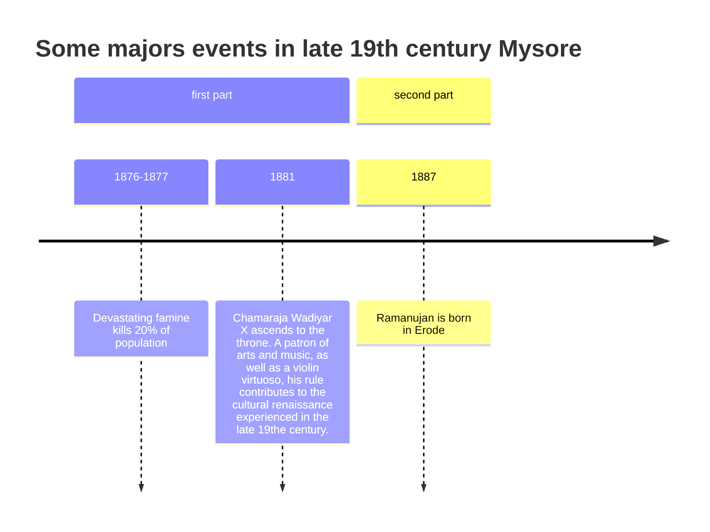

+++
linkTitle = "Ramanujan"
title = "Ramanujan"
draft = true
date = 2024-01-01
+++

# Ramanujan

Srinivasa Ramanujan Aiyangar {Tamil}Tamil {Hindi}Hindi was born 22 December 1887 to a Tamil Brahmin Iyengar family in Erode. On a map of India, this is in a state now called Tamil Nadu. In 1887, Erode was in the Princely State of Mysore. To place this in context of what was happening in that region of the world, here are some events from that region in that time period:

{ photo of Chamaraja }

{ photo of Ramanujan's home }

South India in the late 19th century lacked running water, electricity, and decent sanitation (is this all true?). What it lacked in amenities, it made up for in richness of culture, education, and spirituality.

**Culture**

**Education** - Children educated in British India went on to become world class researchers, including:  

**Sir Chandrasekhara Venkata Raman**: (b. 1888 in Tiruchirapalli, Madras Presidency, British India): 1930 Nobel Prize in Physics for discovery of Raman scattering

**Subrahmanyan Chandrasekhar**: (b. 1910 in Lahore, Punjab, British India): 1983 Nobel Peace Prize for Physics for "...theoretical studies of the physical processes of importance to the structure and evolution of the stars"  

