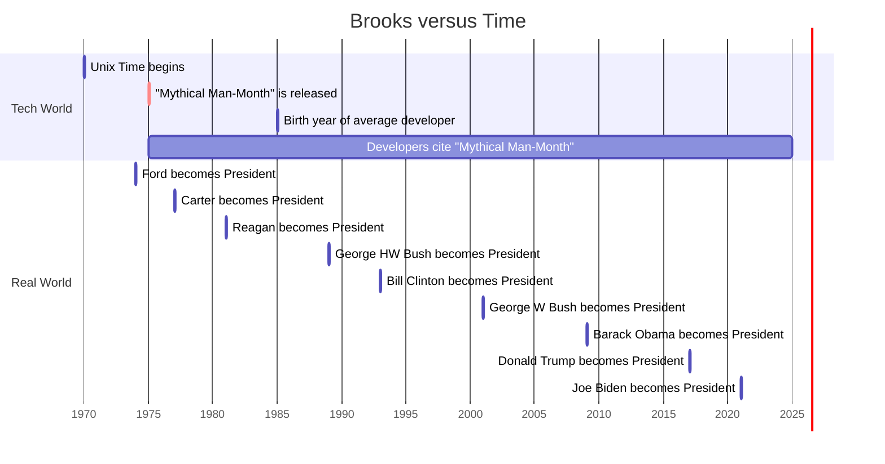

+++
linkTitle = 'Story Points Are Stupid'
title = 'Story Points Are Stupid'
shortTitle = 'Story Points Are Stupid'
date = 2024-07-16T23:29:31-06:00
genres = ['technical']
draft = false
+++

I recently said "fuck it" to "story points". Story points are a made-up system for estimating made-up work in software. It involves getting six software developers in a room, and asking about their deepest wishes, their deepest insecurities, and their deepest fears. After that therapeutic session, the Master of Ceremonies asks each developer for their favorite number. Their favorite number! The Master averages all of these numbers, and then picks another number close to those numbers to represent how "hard" a task is. 

Why does any tech company do this? Because every tech company does this. Software teams at large companies employ this system because they like to be safe and copy other companies, cargo-cult style[^cargo-cult]. The "harder" a task, the more "story points" it's worth. Does this sound ridiculous and infantilizing? It is.

Here's my new system of estimating work. It involves estimating work based on the amount of time it's going to take.  

## The "New" System for Estimating Software Work

Here's the "new" system for estimating software work that I propose:

- 1 "point" is anything between 0.5 and 1 person-day of work
- 2 "points" is 1-2 person days
- etc...

That's it. This is how humanity has estimated work from the dawn of Work. It works[^less-than-one].

Does that sound obvious? Then you must not be a software developer. See, some crackpot developer decided thirty years ago that a man named Fred Brooks[^brooks] was right - software is a magical process of divining "codes" from the ether. This process cannot be rushed, for the Ether is temperamental. Rushing any Process will Anger the Gods of Bits and Bytes, residing within the Ether. Thus, Story Points must be used to make developers feel special - like they're fighting dragons, not pushing numbers around.

## Advantages

This system lets us do realistic projections. This is possible, even if the work estimates are totally off. How, might you ask, is that possible?

Because if it takes a 3-person team 30 days to complete 45 points of work, then we know we're underestimating all our work by a factor of two. That's a super easy thing to address in work retrospectives. "Hey team, why is our work taking twice as long as we estimated? Great, let's account for that in the next cycle. Thanks. Retro meeting over."

No more dick-measuring contests between teams. No more asinine discussions about "story points" or my personal pet-peeve, Fibonacci points[^fibonacci].

## Grow up

As an industry that wants to be taken seriously by other engineers, we HAVE TO GET BETTER AT ESTIMATES. I don't care what the Mythical Man-Month[^mythical-man-month] says - software HAS to become more predictable to make. We HAVE TO find best practices, and know how to make software of a particular type, repeatably and consistently. We HAVE TO make use of statistics to estimate our work, like every other engineering discipline does. For an industry that supposedly came from computer science, which arguably is a branch of applied math - we are absolutely, pathetically LOUSY at using math properly in order to make decisions.

We are not wizards of the occult. We do not have super powers. We do not pull castles from the ether for the world to marvel at. Everyone, get over yourselves. You're white-collar workers with cushy jobs, fat paychecks, and matching 401ks. You aren't rebels - you're just like your parents. You listen to "The Anthem" by Good Charlotte while coding, thinking you're cool - but you wanna be just like them. Quit building air-castles, throwing tantrums, and accumulating story points. Grow the fuck up.

[^cargo-cult]: Tech companies love to make excuses like, "managing people is not the goal of our company. It's writing software," and then go on to foist imaginary systems of management on us all, like some big hilarious experiment to see how stupid we all are.  

[^brooks]: Fred Brooks was a brilliant scientist and engineer. He also likened programmers to one who "builds castles in the air, from air, creating by exertion of the imagination." This may have been a likely analogy in his day, but today, 9/10 "programmers" shamelessly proclaim they would copy and paste code written on a baboon's behind, if it meant they could log off for the day at 3PM instead of 4PM.

[^less-than-one]: Have a task that's much less than 1 day of work? Here are two options. 1) Combine these tasks into one larger task that takes 1 day of work, or 2) Invent a "0.5" point. This task takes no more than a few hours, from starting the task to completing all acceptance criteria and merging any PRs. Don't include these tasks in any estimates of "velocity". Don't like these suggestions? Then fuck off.

[^fibonacci]: Fibonacci pointing is a process where six software "engineers" (\$150/hr each, billable to the client) sit in a Zoom call with a Certified Scrum Master(\$125/hr each, billable to the client), who asks each software "engineer" (\$150/hr each, billable to the client) to estimate how "hard" a task is. They are asked to use the Fibonacci sequence (e.g. 1, 2, 3, 5, 8, 11, etc) to measure how "hard" the task is. Why isn't this just a simple scale of 1-10? Beats me...And yes, there really is a certification called "Certified Scrum Master". In fact, anyone reading this is only 3 days and \$299 away from having the hallowed honorific "CSM" after their name on their next job application!

[^mythical-man-month]: The book, through which Fred Brooks became famous among engineers, came out nearly fifty years ago. It contains pithy sayings like, "Nine women cannot make a baby in a month", and the afore-mentioned Castles in the Sky commentary. Developers in their twenties cite this book as if it's some sort of gospel. "The Mythical Man-Month" was once ahead of its time, but that time has long passed.  